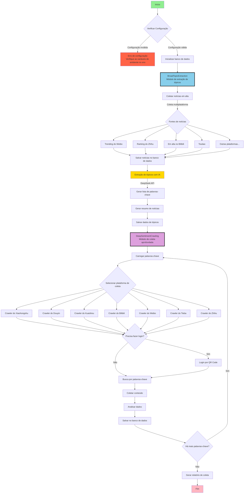

# MindSpider - Crawler com IA projetado para análise de opinião pública

> Aviso Legal:
> Todo o conteúdo deste repositório é destinado exclusivamente para fins de aprendizado e referência, sendo proibido o uso comercial. Nenhuma pessoa ou organização pode utilizar o conteúdo deste repositório para fins ilegais ou para violar os direitos legítimos de terceiros. As técnicas de web scraping abordadas neste repositório são exclusivamente para aprendizado e pesquisa, não devendo ser utilizadas para raspagem em larga escala em outras plataformas ou qualquer outro comportamento ilegal. Este repositório não assume nenhuma responsabilidade legal decorrente do uso de seu conteúdo. Ao utilizar o conteúdo deste repositório, você concorda com todos os termos e condições deste aviso legal.

## Visão Geral do Projeto

MindSpider é um sistema inteligente de crawler para análise de opinião pública baseado em tecnologia Agent. Através de IA, identifica automaticamente tópicos em alta e realiza coleta precisa de conteúdo em múltiplas plataformas de mídia social. O sistema utiliza design modular, permitindo um fluxo totalmente automatizado desde a descoberta de tópicos até a coleta de conteúdo.

Este módulo foi inspirado e desenvolvido com base no conhecido projeto de crawler do GitHub [MediaCrawler](https://github.com/NanmiCoder/MediaCrawler)

Coleta em duas etapas:

- Módulo Um: O Search Agent identifica notícias em alta em **13** plataformas de mídia social e fóruns técnicos, incluindo Weibo, Zhihu, GitHub, Coolapk, entre outros, e mantém uma tabela de análise de tópicos diários.
- Módulo Dois: O crawler multiplataforma realiza coleta aprofundada de feedback de opinião pública granular para cada tópico.

<div align="center">


Exemplo de execução do MindSpider
</div>

### Arquitetura Técnica

- **Linguagem de Programação**: Python 3.9+
- **Framework de IA**: Deepseek por padrão, compatível com diversas APIs (extração e análise de tópicos)
- **Framework de Crawler**: Playwright (automação de navegador)
- **Banco de Dados**: MySQL / PostgreSQL (armazenamento persistente de dados)
- **Processamento Concorrente**: AsyncIO (coleta assíncrona e concorrente)

## Estrutura do Projeto

```
MindSpider/
├── BroadTopicExtraction/           # Módulo de extração de tópicos
│   ├── database_manager.py         # Gerenciador de banco de dados
│   ├── get_today_news.py          # Coletor de notícias
│   ├── main.py                    # Ponto de entrada do módulo
│   └── topic_extractor.py         # Extrator de tópicos com IA
│
├── DeepSentimentCrawling/         # Módulo de coleta aprofundada
│   ├── keyword_manager.py         # Gerenciador de palavras-chave
│   ├── main.py                   # Ponto de entrada do módulo
│   ├── platform_crawler.py       # Gerenciador de crawler por plataforma
│   └── MediaCrawler/             # Núcleo do crawler multiplataforma
│       ├── base/                 # Classes base
│       ├── cache/                # Sistema de cache
│       ├── config/               # Arquivos de configuração
│       ├── media_platform/       # Implementação por plataforma
│       │   ├── bilibili/        # Crawler do Bilibili
│       │   ├── douyin/          # Crawler do Douyin
│       │   ├── kuaishou/        # Crawler do Kuaishou
│       │   ├── tieba/           # Crawler do Tieba
│       │   ├── weibo/           # Crawler do Weibo
│       │   ├── xhs/             # Crawler do Xiaohongshu
│       │   └── zhihu/           # Crawler do Zhihu
│       ├── model/               # Modelos de dados
│       ├── proxy/               # Gerenciamento de proxy
│       ├── store/               # Camada de armazenamento
│       └── tools/               # Ferramentas utilitárias
│
├── schema/                       # Esquema do banco de dados
│   ├── db_manager.py            # Gerenciamento do banco de dados
│   ├── init_database.py         # Script de inicialização
│   └── mindspider_tables.sql    # Definição da estrutura das tabelas
│
├── config.py                    # Arquivo de configuração global
├── main.py                      # Ponto de entrada do sistema
├── requirements.txt             # Lista de dependências
└── README.md                    # Documentação do projeto
```

## Fluxo de Trabalho do Sistema

### Diagrama de Fluxo da Arquitetura Geral



### Descrição do Fluxo de Trabalho

#### 1. BroadTopicExtraction (Módulo de Extração de Tópicos)

Este módulo é responsável pela descoberta e extração automática de tópicos em alta diariamente:

1. **Coleta de Notícias**: Coleta automática de notícias em alta de múltiplas plataformas principais (Weibo, Zhihu, Bilibili, etc.)
2. **Análise com IA**: Utiliza a API do DeepSeek para análise inteligente das notícias
3. **Extração de Tópicos**: Identifica automaticamente tópicos em alta e gera palavras-chave relacionadas
4. **Armazenamento de Dados**: Salva tópicos e palavras-chave no banco de dados MySQL

#### 2. DeepSentimentCrawling (Módulo de Coleta Aprofundada)

Com base nas palavras-chave dos tópicos extraídos, realiza coleta aprofundada de conteúdo nas principais plataformas sociais:

1. **Carregamento de Palavras-chave**: Lê do banco de dados as palavras-chave extraídas no dia
2. **Coleta por Plataforma**: Utiliza o Playwright para coleta automatizada em 7 grandes plataformas
3. **Análise de Conteúdo**: Extrai postagens, comentários, dados de interação, etc.
4. **Análise de Sentimento**: Realiza análise de tendência de sentimento no conteúdo coletado
5. **Persistência de Dados**: Armazena todos os dados de forma estruturada no banco de dados

## Arquitetura do Banco de Dados

### Tabelas Principais

1. **daily_news** - Tabela de notícias diárias
   - Armazena notícias em alta coletadas das plataformas
   - Contém título, link, descrição, ranking e outras informações

2. **daily_topics** - Tabela de tópicos diários
   - Armazena tópicos e palavras-chave extraídos pela IA
   - Contém nome do tópico, descrição, lista de palavras-chave, etc.

3. **topic_news_relation** - Tabela de relação entre tópicos e notícias
   - Registra a relação de associação entre tópicos e notícias
   - Contém pontuação de relevância

4. **crawling_tasks** - Tabela de tarefas de coleta
   - Gerencia as tarefas de coleta de cada plataforma
   - Registra status da tarefa, progresso, resultados, etc.

5. **Tabelas de conteúdo por plataforma** (herdadas do MediaCrawler)
    - xhs_note - Notas do Xiaohongshu
    - douyin_aweme - Vídeos do Douyin
   - kuaishou_video - Vídeos do Kuaishou
   - bilibili_video - Vídeos do Bilibili
   - weibo_note - Postagens do Weibo
   - tieba_note - Postagens do Tieba
   - zhihu_content - Conteúdo do Zhihu

## Instalação e Implantação

### Requisitos do Ambiente

- Python 3.9 ou superior
- MySQL 5.7 ou superior, ou PostgreSQL
- Ambiente Conda: pytorch_python11 (recomendado)
- Sistema Operacional: Windows/Linux/macOS


### 1. Clonar o projeto e obter os submódulos

O MindSpider funciona como componente central do BettaFish. Clone o projeto principal BettaFish e obtenha simultaneamente o submódulo do crawler `MediaCrawler`.

**Opção 1: Obter ao clonar (recomendado)**

```bash
git clone --recurse-submodules https://github.com/666ghj/BettaFish.git
cd BettaFish/MindSpider
```

**Opção 2: Complementar após já ter clonado o projeto principal**

Se você já clonou o BettaFish, mas o diretório `MindSpider/DeepSentimentCrawling/MediaCrawler` está vazio, execute no **diretório raiz do projeto**:

```bash
git submodule update --init --recursive
```

> **Nota**: As dependências Python do MediaCrawler serão automaticamente detectadas e instaladas no ambiente atual na primeira execução de `uv run main.py --deep-sentiment`.

### 2. Criar e ativar o ambiente

#### Método de configuração com Conda

#### Método de configuração com Conda

```bash
# Criar ambiente conda chamado pytorch_python11 especificando a versão do Python
conda create -n pytorch_python11 python=3.11
# Ativar o ambiente
conda activate pytorch_python11
```

#### Método de configuração com UV

> [UV é uma ferramenta rápida e leve para gerenciamento de pacotes e ambientes Python, ideal para necessidades de baixa dependência e gerenciamento prático. Referência: https://github.com/astral-sh/uv]

- Instalar o uv (caso ainda não esteja instalado)
```bash
pip install uv
```
- Criar e ativar ambiente virtual
```bash
uv venv --python 3.11 # Criar ambiente 3.11
source .venv/bin/activate   # Linux/macOS
# ou
.venv\Scripts\activate      # Windows
```


### 3. Instalar dependências

```bash
# Instalar dependências Python
pip install -r requirements.txt

ou
# Versão com uv, mais rápida
uv pip install -r requirements.txt


# Instalar drivers de navegador do Playwright
playwright install
```

### 4. Configurar o sistema

Copie o arquivo .env.example para .env e coloque-o no diretório raiz do projeto. Edite o arquivo `.env` para configurar o banco de dados e a API:

```python
# Configuração do banco de dados (exemplo MySQL)
DB_DIALECT = "mysql"       # mysql ou postgresql
DB_HOST = "your_database_host"
DB_PORT = 3306
DB_USER = "your_username"
DB_PASSWORD = "your_password"
DB_NAME = "mindspider"
DB_CHARSET = "utf8mb4"     # Pode ser omitido para PostgreSQL

# Exemplo PostgreSQL (altere DB_DIALECT acima para postgresql e DB_PORT para 5432)
# DB_DIALECT = "postgresql"
# DB_PORT = 5432

# Chave de API do MINDSPIDER
MINDSPIDER_BASE_URL=your_api_base_url
MINDSPIDER_API_KEY=sk-your-key
MINDSPIDER_MODEL_NAME=deepseek-chat
```

### 5. Inicializar o sistema

```bash
# Verificar status do sistema
python main.py --status
# ou
uv run main.py --status
```

## Guia de Uso

### Fluxo Completo

```bash
# 1. Executar extração de tópicos (obter notícias em alta e palavras-chave)
python main.py --broad-topic
# ou
uv run main.py --broad-topic

# 2. Executar crawler (coletar conteúdo das plataformas com base nas palavras-chave)
python main.py --deep-sentiment --test
# ou
uv run main.py --deep-sentiment --test

# Ou executar o fluxo completo de uma vez
python main.py --complete --test
# ou
uv run main.py --complete --test
```

### Usar módulos individualmente

```bash
# Apenas obter tópicos em alta e palavras-chave do dia
python main.py --broad-topic
# ou
uv run main.py --broad-topic

# Coletar apenas de plataformas específicas
python main.py --deep-sentiment --platforms xhs dy --test
# ou
uv run main.py --deep-sentiment --platforms xhs dy --test

# Especificar data
python main.py --broad-topic --date 2024-01-15
# ou
uv run main.py --broad-topic --date 2024-01-15
```

## Configuração do Crawler (Importante)

### Configuração de Login por Plataforma

**O primeiro uso de cada plataforma requer login, esta é a etapa mais importante:**

1. **Login no Xiaohongshu**
```bash
# Testar coleta do Xiaohongshu (exibirá QR code)
python main.py --deep-sentiment --platforms xhs --test
# ou
uv run main.py --deep-sentiment --platforms xhs --test
# Escaneie o QR code com o app Xiaohongshu para fazer login. Após login bem-sucedido, o estado será salvo automaticamente
```

2. **Login no Douyin**
```bash
# Testar coleta do Douyin
python main.py --deep-sentiment --platforms dy --test
# ou
uv run main.py --deep-sentiment --platforms dy --test
# Escaneie o QR code com o app Douyin para fazer login
```

3. **Outras plataformas seguem o mesmo processo**
```bash
# Kuaishou
uv run main.py --deep-sentiment --platforms ks --test

# Bilibili
uv run main.py --deep-sentiment --platforms bili --test

# Weibo
uv run main.py --deep-sentiment --platforms wb --test

# Tieba
uv run main.py --deep-sentiment --platforms tieba --test

# Zhihu
uv run main.py --deep-sentiment --platforms zhihu --test
```

### Solução de Problemas de Login

**Se o login falhar ou travar:**

1. **Verificar rede**: Certifique-se de que consegue acessar normalmente a plataforma correspondente
2. **Desativar modo headless**: Edite `DeepSentimentCrawling/MediaCrawler/config/base_config.py`
   ```python
   HEADLESS = False  # Altere para False para ver a interface do navegador
   ```
3. **Verificação manual**: Algumas plataformas podem exigir resolução manual de captcha
4. **Refazer login**: Delete o diretório `DeepSentimentCrawling/MediaCrawler/browser_data/` e faça login novamente

### Outros Problemas

https://github.com/666ghj/BettaFish/issues/185

### Ajuste de Parâmetros de Coleta

Antes do uso em produção, recomenda-se ajustar os parâmetros de coleta:

```bash
# Teste em pequena escala (recomendado testar assim primeiro)
python main.py --complete --test
# ou
uv run main.py --complete --test

# Ajustar quantidade de coleta
python main.py --complete --max-keywords 20 --max-notes 30
# ou
uv run main.py --complete --max-keywords 20 --max-notes 30
```

### Funcionalidades Avançadas

#### 1. Operação por data específica
```bash
# Extrair tópicos de uma data específica
python main.py --broad-topic --date 2024-01-15
# ou
uv run main.py --broad-topic --date 2024-01-15

# Coletar conteúdo de uma data específica
python main.py --deep-sentiment --date 2024-01-15
# ou
uv run main.py --deep-sentiment --date 2024-01-15
```

#### 2. Coleta por plataforma específica
```bash
# Coletar apenas do Bilibili e Douyin
python main.py --deep-sentiment --platforms bili dy --test
# ou
uv run main.py --deep-sentiment --platforms bili dy --test

# Coletar quantidade específica de conteúdo de todas as plataformas
python main.py --deep-sentiment --max-keywords 30 --max-notes 20
# ou
uv run main.py --deep-sentiment --max-keywords 30 --max-notes 20
```

## Parâmetros Comuns

```bash
--status              # Verificar status do projeto
--setup               # Inicializar projeto (obsoleto, agora inicializa automaticamente)
--broad-topic         # Extração de tópicos
--deep-sentiment      # Módulo de crawler
--complete            # Fluxo completo
--test                # Modo de teste (poucos dados)
--platforms xhs dy    # Especificar plataformas
--date 2024-01-15     # Especificar data
```

## Plataformas Suportadas

| Código | Plataforma | Código | Plataforma |
|-----|-----|-----|-----|
| xhs | Xiaohongshu | wb | Weibo |
| dy | Douyin | tieba | Tieba |
| ks | Kuaishou | zhihu | Zhihu |
| bili | Bilibili | | |

## Perguntas Frequentes

### 1. Falha no login do crawler
```bash
# Problema: QR code não aparece ou login falha
# Solução: Desativar modo headless e fazer login manualmente
# Editar: DeepSentimentCrawling/MediaCrawler/config/base_config.py
HEADLESS = False

# Executar login novamente
python main.py --deep-sentiment --platforms xhs --test
# ou
uv run main.py --deep-sentiment --platforms xhs --test
```

### 2. Falha na conexão com o banco de dados
```bash
# Verificar configuração
python main.py --status
# ou
uv run main.py --status

# Verificar se a configuração do banco de dados no config.py está correta
```

### 3. Falha na instalação do playwright
```bash
# Reinstalar
pip install playwright

ou

uv pip install playwright

playwright install
```

### 4. Dados coletados vazios
- Certifique-se de que o login na plataforma foi realizado com sucesso
- Verifique se existem palavras-chave (execute primeiro a extração de tópicos)
- Valide usando o modo de teste: `--test`

### 5. Falha na chamada da API
- Verifique se a chave da API do DeepSeek está correta
- Confirme se o saldo/cota da API é suficiente

## Observações Importantes

1. **O primeiro uso requer login em cada plataforma**
2. **Recomenda-se validar primeiro com o modo de teste**
3. **Respeite as regras de uso das plataformas**
4. **Apenas para uso em aprendizado e pesquisa**

## Guia de Desenvolvimento do Projeto

### Adicionar novas fontes de notícias

Adicione novas fontes de notícias em `BroadTopicExtraction/get_today_news.py`:

```python
async def get_new_platform_news(self) -> List[Dict]:
    """Obter notícias em alta de uma nova plataforma"""
    # Implementar lógica de coleta de notícias
    pass
```

### Adicionar nova plataforma de crawler

1. Crie um novo diretório para a plataforma em `DeepSentimentCrawling/MediaCrawler/media_platform/`
2. Implemente os módulos de funcionalidade principal da plataforma:
   - `client.py`: Cliente da API
   - `core.py`: Lógica principal do crawler
   - `login.py`: Lógica de login
   - `field.py`: Definição dos campos de dados

### Extensão do Banco de Dados

Para adicionar novas tabelas ou campos, atualize `schema/mindspider_tables.sql` e execute:

```bash
python schema/init_database.py
```

## Sugestões de Otimização de Desempenho

1. **Otimização do Banco de Dados**
   - Limpe periodicamente dados históricos
   - Crie índices para campos de consulta frequente
   - Considere usar tabelas particionadas para gerenciar grandes volumes de dados

2. **Otimização de Coleta**
   - Configure intervalos de coleta adequados para evitar bloqueios
   - Use pool de proxies para maior estabilidade
   - Controle a concorrência para evitar esgotamento de recursos

3. **Otimização do Sistema**
   - Use Redis para cache de dados frequentes
   - Filas de tarefas assíncronas para operações demoradas
   - Monitore regularmente o uso de recursos do sistema

## Documentação da API

O sistema fornece uma API Python para desenvolvimento secundário:

```python
from BroadTopicExtraction import BroadTopicExtraction
from DeepSentimentCrawling import DeepSentimentCrawling

# Extração de tópicos
async def extract_topics():
    extractor = BroadTopicExtraction()
    result = await extractor.run_daily_extraction()
    return result

# Coleta de conteúdo
def crawl_content():
    crawler = DeepSentimentCrawling()
    result = crawler.run_daily_crawling(
        platforms=['xhs', 'dy'],
        max_keywords=50,
        max_notes=30
    )
    return result
```

## Licença

Este projeto é destinado exclusivamente para uso em aprendizado e pesquisa. Por favor, não o utilize para fins comerciais. Ao utilizar este projeto, respeite as leis e regulamentos aplicáveis, bem como os termos de serviço das plataformas.

---

**MindSpider** - Deixe a IA impulsionar a percepção de opinião pública, um assistente poderoso para análise inteligente de conteúdo
